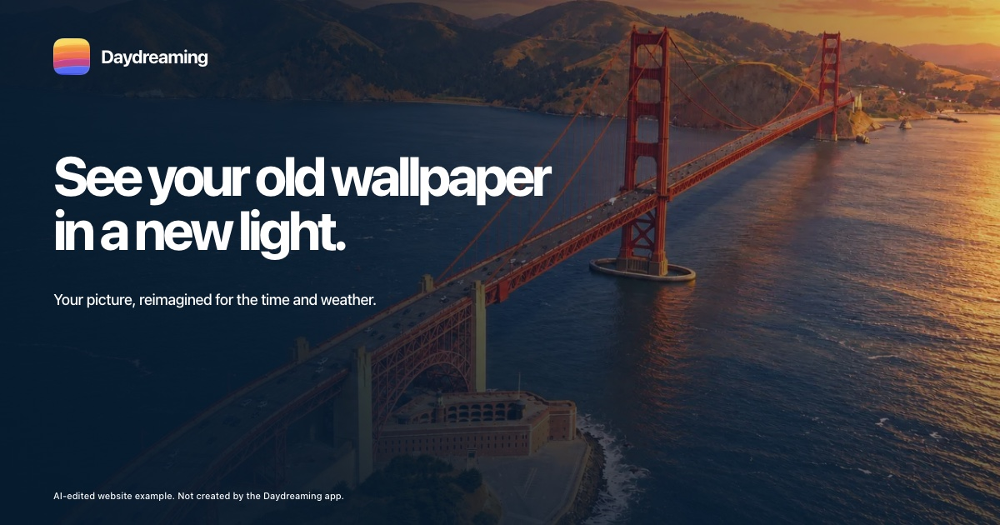

# Daydreaming website

The source for [getdaydreaming.com](https://getdaydreaming.com), the website for [Daydreaming for Mac](https://github.com/spatie/daydreaming-app). Daydreaming turns a picture into wallpapers that follow the time of day and local weather.



This Laravel application serves the interactive landing page, support and privacy pages, app downloads, release notes, and the signed appcast used for updates. It also accepts installation reports and feature suggestions from the Mac app. A Filament admin panel shows those submissions and installation statistics.

## Run locally

You need PHP 8.5 with Composer, Node.js with npm, and SQLite.

```sh
composer install
npm ci
cp .env.example .env
php artisan key:generate --no-interaction
touch database/database.sqlite
php artisan migrate --no-interaction
```

Start the Laravel server and Vite in separate terminals:

```sh
php artisan serve --no-interaction
```

```sh
npm run dev
```

Visit [localhost:8000](http://localhost:8000). The download link stays unavailable until an app release has been published.

## Tests

```sh
npm run build
php artisan test --compact
node --test tests/*.test.js
```

## Configuration

`.env.example` lists the available settings. A local install uses SQLite and needs no external services. Publishing app releases requires a release token and an object storage URL. Google login for the admin panel requires OAuth credentials and an email listed in `ADMIN_EMAILS`.

The original photo credits are on the [credits page](https://getdaydreaming.com/credits). The device frame license is in [public/device-frames-license.txt](public/device-frames-license.txt).
